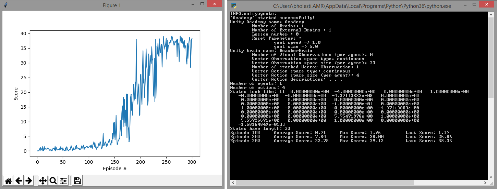

# Project Details
I started this project with the Bipedal DDPG code from https://github.com/udacity/deep-reinforcement-learning/tree/master/ddpg-bipedal. The Actor NN is fully connected with 33 inputs describing state information, a hidden layer with 256 neurons and an output layer with 4 neurons, the rectified linear unit is used internally and hyperbolic tangent is used on the output. The Critic Network has three hidden layers of size 256, 256 and 128, it takes state information as input and concatenates that with the actions at the second hidden layer, leaky rectified linear units are used throughout. I added batch normalization to the input of each network and performed a minor update every 20 steps and a major update every 200 with a batch size of 1024. The noise function was replaced with a Gaussian distribution centered at 0 with a standard deviation of 1. The additional hyperparamters are shown below. This environment was solved at roughly the 225th episode.

# Reward History

# Improvements
It seems like convergence would improve if the rewards from the environment took into account distance from the ball and/or trajectory of the arm. Also noticed some jitter once the environment was solved that would be undesirable in a real world device but could possibly be fine tuned out by continuing training but deducting a small amount from the environment's rewards based on the amount of energy it would take to move a physical arm encouraging the network to learn efficiency of motion. Using multipe agents as suggested in the course would provide more diverse training data and accelerate convergence also the TNPG and TRPO variations described in the "Benchmarking Deep Reinforcement Learning for Continuous Control" paper could help with this environment. 
