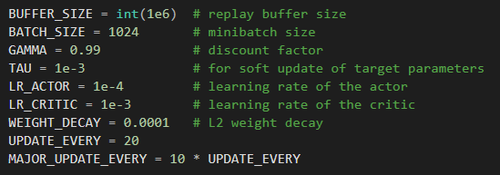

# Introduction
I've gone through the DDPG paper a few times and tried a variety of things but haven't been able to get the required score. So here's what I've done so far, hopefully I can get some feedback on what I'm overlooking.

# Project Details
I started this project with the Bipedal DDPG code from https://github.com/udacity/deep-reinforcement-learning/tree/master/ddpg-bipedal. The Actor NN is fully connected with 33 inputs describing state information, a hidden layer with 256 neurons and an output layer with 4 neurons, the rectified linear unit is used internally and hyperbolic tangent is used on the output. The Critic Network has three hidden layers of size 256, 256 and 128, it takes state information as input and concatenates that with the actions at the second hidden layer, leaky rectified linear units are used throughout. I added batch normalization to the input of each network and performed a minor update every 20 steps and a major update 200 with a batch size of 1024. The noise function was replaced with a Gaussian distribution centered at 0 with a standard deviation of 1. The additional hyperparamters are shown below.

# Reward History

# Improvements
I'll update this when I get better results.
Shrink ball
Jitter
