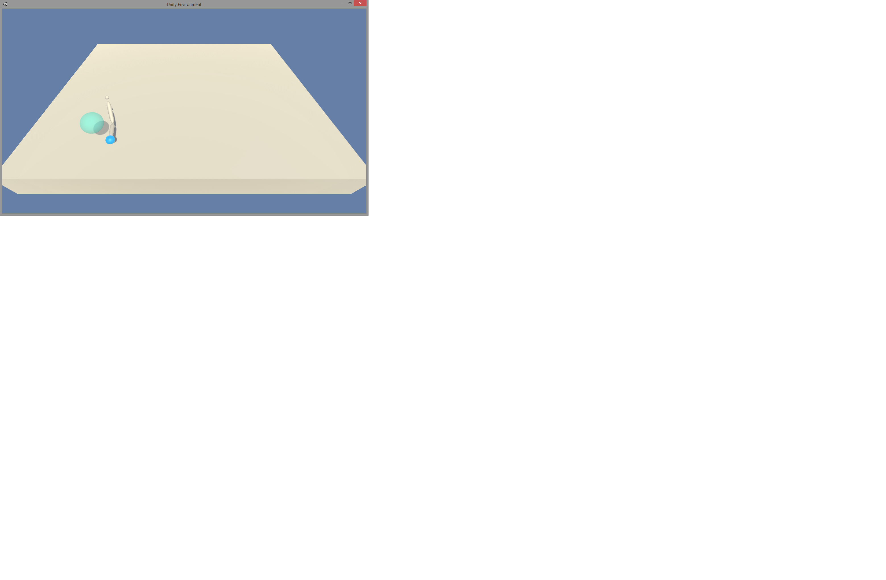
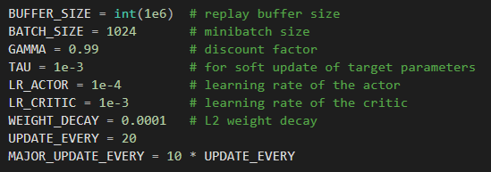
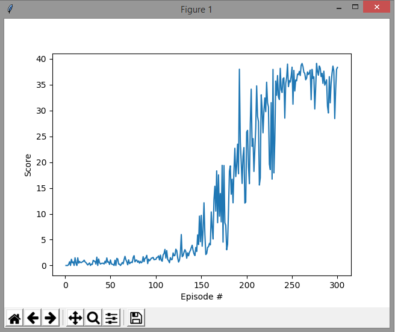

# Project Details
This project uses a Deep Deterministic Policy Gradient (DDPG) Network to create a control for a virtual robotic arm.

# Environment
In this environment, a double-jointed arm can move to target locations. A reward of +0.1 is provided for each step that the agent's hand is in the goal location. Thus, the goal of the agent is to maintain its position at the target location for as many time steps as possible.

# Learning Algorithm
The Actor NN is fully connected with 33 inputs describing state information, a hidden layer with 256 neurons and an output layer with 4 neurons that specify continuous positions for each of the joints. The rectified linear unit is used internally and hyperbolic tangent is used on the output. The Critic Network has three hidden layers of size 256, 256 and 128, it takes state information as input and concatenates that with the actions at the second hidden layer, leaky rectified linear units are used throughout. I added batch normalization to the input of each network and performed a minor update every 20 steps and a major update every 200 with a batch size of 1024. The noise function was replaced with a Gaussian distribution centered at 0 with a standard deviation of 1. The additional hyperparamters are shown below. This environment was solved at roughly the 225th episode.

# Reward History

# Improvements
Convergence should be accelerated by providing reward values that take into account distance from the ball.
Jitter in the arm may be removed by fine tuning of the current weights with noise in the environment. Some deduction could also be applied to the reward if jitter is detected.
Multiple environments could be used in parallel to populate the replay buffer with more diverse data. 
Could incorporate Truncated Natural Policy Gradient (TNPG) or Trust Region Policy Optimization (TRPO) as discussed in https://arxiv.org/pdf/1604.06778.pdf.

# Credits
This project is based on the code at https://github.com/udacity/deep-reinforcement-learning/tree/master/ddpg-bipedal 

# Additional Info
https://arxiv.org/pdf/1604.06778.pdf
