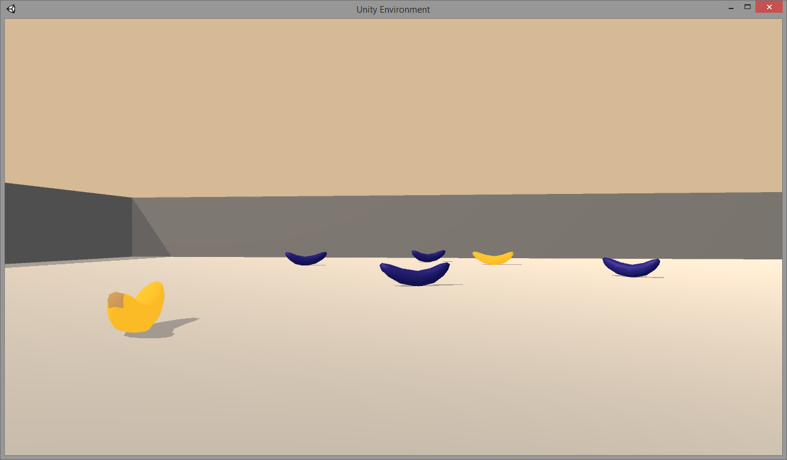
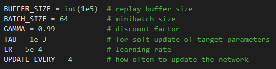
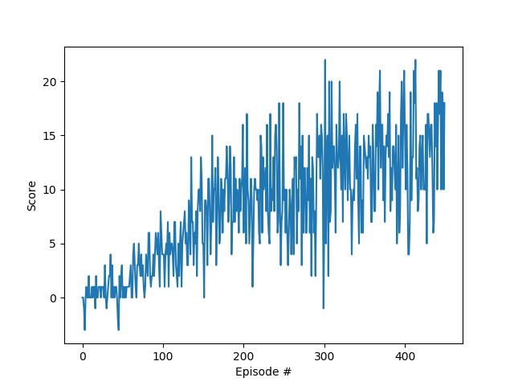

# Project Details
This project uses a Deep Q-Network (DQN) to create a controller that collects yellow bananas in a virtual environment. 

# Environment
 A reward of +1 is provided for collecting a yellow banana, and a reward of -1 is provided for collecting a blue banana. Thus, the goal of the agent is to collect as many yellow bananas as possible while avoiding blue bananas. The environment is considered solved when the 100 most recent rewards averages at least 13.

 

# Learning Algorithm
There are 4 discrete actions for the entity (left, right, forward and backward) and 37 continuous observations for the state. The DQN has a fully connected architecture with 37 inputs, 4 outputs and two hidden layers each with 64 neurons. The ReLU activation function is used in all layers with a learning rate of .0005. The DQN algorithm runs 1000 episodes for a maximum of 1000 time steps and uses an epsilon greedy policy with an initial value of 1 a minimum value of .01 and a decay rate of .99.

# Reward History

# Improvements
The design could be modified to use a convolutional network and accept the pixels as input rather than using the 37 state variables. 
A replay buffer could be incorporated to reduce the temporal dependence. 

# Additional Info
https://www.nature.com/articles/nature14236
