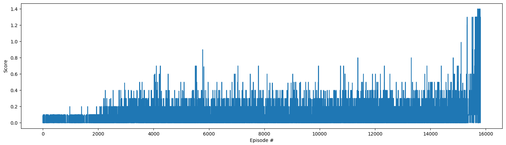

# Project Details
This project uses a Multi Agent Deep Deterministic Policy Gradient (MADDPG) Network to create controllers for virtual tennis players.

# Environment
In this environment, two agents control rackets to bounce a ball over a net. If an agent hits the ball over the net, it receives a reward of +0.1. If an agent lets a ball hit the ground or hits the ball out of bounds, it receives a reward of -0.01. Thus, the goal of each agent is to keep the ball in play.

The observation space consists of 8 continuous variables corresponding to the position and velocity of the ball and racket. Each agent receives its own, local observation. Two continuous actions are available, corresponding to movement toward (or away from) the net, and jumping.

The task is episodic, and in order to solve the environment, the agents must get an average score of +0.5 (over 100 consecutive episodes, after taking the maximum over both agents). Specifically, after each episode, we add up the rewards that each agent received (without discounting), to get a score for each agent. This yields 2 (potentially different) scores. We then take the maximum of these 2 scores. This yields a single score for each episode.

# Learning Algorithm
This architecture uses an Actor and Critic NN. The Actor Network is fully connected with 24 inputs (8 variables * 3 dimensions) that describe state information, a hidden layer with 256 neurons and an output layer with 2 neurons, the rectified linear unit is used internally and hyperbolic tangent is used on the output. The Critic Network has three layers of size 256, 256 and 128, it also takes state information as input to the first layer then concatenates that output with the two actions at the second layer, leaky rectified linear units are used throughout. Batch normalization is used on the input of each network and a minor update is performed every 20 episodes with a batch size of 1024 as well as a major update every 200 episodes. Gaussian noise with a distribution centered at 0 and a standard deviation of 1 is initially added to the action the Actor produces to help explore the environment. Once a score of 1.0 is obtained major updates are disabled and the noise is turned off. Learning then continues until the an average score of 1.0 is obtained doubling what's necesarry to solve the envronment, this typically happens around 16,000 episodes. 

# Reward History

# Improvements
Dropout layers could be used in the actor and critic. 
Multiple environments could be used in parallel to populate the replay buffer with more diverse data. 
Different buffers could be used for the actor and critic and a prioritized replay buffer could be used to keep the most relevant episodes (https://github.com/Damcy/prioritized-experience-replay). 
Action noise could be replaced with parameter noise (https://vimeo.com/252185862 , https://github.com/jvmancuso/ParamNoise).

# Credits
This project is based on the code at https://github.com/udacity/deep-reinforcement-learning/tree/master/ddpg-bipedal 
