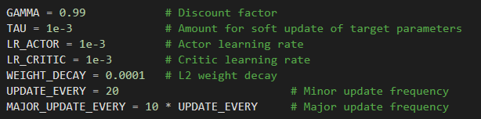

# Project Details
This project uses a Multi Agent Deep Deterministic Policy Gradient (MADDPG) Network to create controllers for virtual tennis players. There are 24 observations for the state used by the actor network which provides 2 actions that correspond to position from the net and the ground.  

# Environment
In this environment, two agents control rackets to bounce a ball over a net. If an agent hits the ball over the net, it receives a reward of +0.1. If an agent lets a ball hit the ground or hits the ball out of bounds, it receives a reward of -0.01. Thus, the goal of each agent is to keep the ball in play.

The observation space consists of 8 continuous variables corresponding to the position and velocity of the ball and racket. Each agent receives its own, local observation. Two continuous actions are available, corresponding to movement toward (or away from) the net, and jumping.

The task is episodic, and in order to solve the environment, the agents must get an average score of +0.5 (over 100 consecutive episodes, after taking the maximum over both agents). Specifically, after each episode, we add up the rewards that each agent received (without discounting), to get a score for each agent. This yields 2 (potentially different) scores. We then take the maximum of these 2 scores. This yields a single score for each episode.

# Learning Algorithm
The Actor NN is fully connected with 24 inputs describing state information, a hidden layer with 256 neurons and an output layer with 2 neurons, the rectified linear unit is used internally and hyperbolic tangent is used on the output. The Critic Network has three hidden layers of size 256, 256 and 128, it takes state information as input and concatenates that with the actions at the second hidden layer, leaky rectified linear units are used throughout. Batch normalization is used on the input of each network and a minor update is performed every 100 episodes with a batch size of 1024 as well as a major update every 1000 episodes using Gaussian noise with a distribution centered at 0 with a standard deviation of 1. Once a score of 1.0 is obtained the learning rates are reduced by an order of magnitude, the noise is turned off and the major update is disabled. Learning then continues until the environment is solved. 

15,000 episodes to get to state change

# Reward History

# Improvements
Similar to the continuous control project, multiple environments could be used in parallel to fill the replay buffer with more diverse data. Could also use a prioritized replay buffer to maintain episodes that improve learning (https://github.com/Damcy/prioritized-experience-replay) or use different buffers for the actor and critic. Dropout layers could be used in the actor and critic. Action noise could be replaced with parameter noise (https://vimeo.com/252185862 , https://github.com/jvmancuso/ParamNoise).

# Credits
This project is based on the code at https://github.com/udacity/deep-reinforcement-learning/tree/master/ddpg-bipedal 