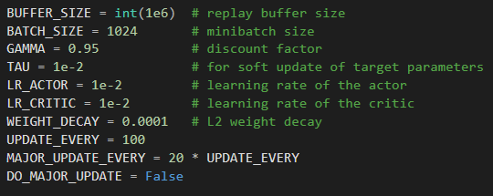

# Learning Algorithm
I began this project with the DDPG code I submitted for the continuous control project posted at https://github.com/holestine/Reinforcement-Learning/tree/master/ContinuousControl. The Actor NN is fully connected with 24 inputs describing state information, a hidden layer with 256 neurons and an output layer with 2 neurons, the rectified linear unit is used internally and hyperbolic tangent is used on the output. The Critic Network has three hidden layers of size 256, 256 and 128, it takes state information as input and concatenates that with the actions at the second hidden layer, leaky rectified linear units are used throughout. I kept the batch normalization from the previous project on the input of each network and performed a minor update every 100 episodes with a batch size of 1024 as well as a major update every 1000 episodes using Gaussian noise with a distribution centered at 0 with a standard deviation of 1. This produces scores in the solved range but didn't stabalize after 10,000 episodes so I saved the weights that produced the highest score of 1.3, reduced the learning rates by an order of magnitude, disabled the major update, disabled noise and trained again this time solving the environment after 2900 episodes and producing average scores as high as 1.09 at 5500 episodes.

# Reward History

# Improvements
Similar to the continuous control project, multiple environments could be used in parallel to fill the replay buffer with more diverse data. Could also use a prioritized replay buffer to maintain episodes that improve learning (https://github.com/Damcy/prioritized-experience-replay) or use different buffers for the actor and critic. Dropout layers could be used in the actor and critic. Action noise could be replaced with parameter noise (https://vimeo.com/252185862 , https://github.com/jvmancuso/ParamNoise).
