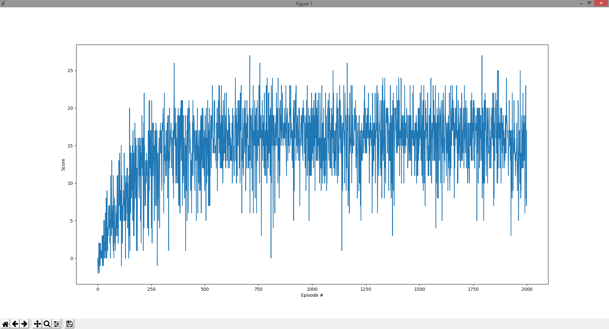

Training is run until an average score of 20 is reached or a total of 2000 episodes have been completed. 

The reward system could be modified to account for the number of time steps between positive rewards for better path planning or perhaps penalizing more for collecting blue bananas to learn avoidance. 

Learning from the pixels because the state information is a simplification, may also include a third person view to expose more of the environment.

37-64-64-4

