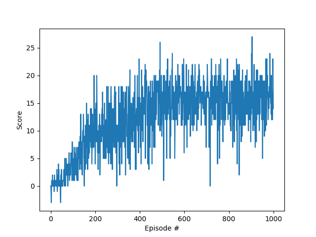

# Project Details
The underlying neural network has a fully connected architecture with 37 inputs, 4 outputs and two hidden layers each with 64 neurons. The ReLU activation function is used in all layers with a learning rate of .0005. The DQN algorithm runs 1000 episodes for a maximum of 1000 time steps and uses an epsilon greedy policy with an initial value 1 a minimum value of .01 and a decay rate of .99.

# Reward History
The total rewards for each episode are shown in the diagram below where the maximum score was 27 and the last 100 had an average of approximatelly 16. The average score exceeded 13 after about 400 time steps but was allowed to run until all episodes completed or an average score of 20 was obtained (this never happened).

# Improvements

Learning from the pixels because the state information is a simplification, may also include a third person view to expose more of the environment.

replay
